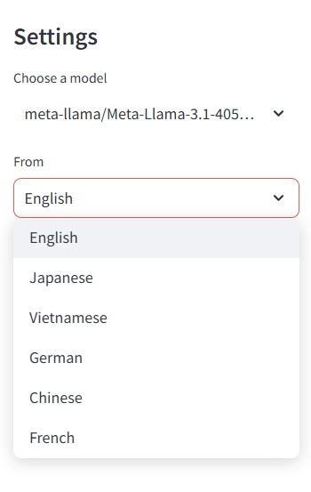

# LLaMA Translator

## Overview

**LLaMA Translator** is an advanced translation tool powered by the **LLaMA 3.1** language model, designed to provide high-quality translations with a deep understanding of cultural context across various languages.

> "Language is the bridge that connects cultures, but translating between languages is far from straightforward. It's a nuanced art that goes beyond merely substituting words."

## Key Features

- **Context-Aware Translation**: Analyzes and captures the cultural context to generate natural and accurate translations.
- **Multilingual Support**: Currently supports translation from **English to Vietnamese** (with additional languages in development).
- **Cultural Analysis**: Provides insights on cultural references and deeper meanings in text.
- **Tone Preservation**: Maintains the original intent and tone of the text in the translated output.

## Technology

- Powered by **Meta-LLaMA 3.1-405B** to ensure top-tier translations.
- Built on **advanced AI** technology with the ability to comprehend cultural nuances.
- Features an **intuitive, user-friendly interface** for seamless use.

## How to Use

1. **Select the language model** (default: meta-llama/Meta-LLaMA-3.1-405B).
2. **Choose the source language** (`From`).
3. **Choose the target language** (`To`).
4. **Set the context** for more accurate results (`Context`).
5. **Enter the text** to be translated.
6. **Click "Translate and Analyze"** to receive the translated output.

## Example

**Original text (English):**

**Translated text (Vietnamese):**

**Translation result:**

